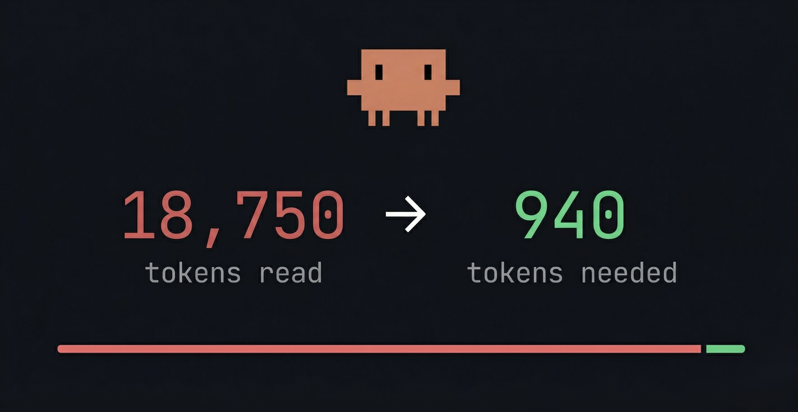

# aft-mcp

<p align="center">
  
</p>

Tree-sitter powered code analysis MCP server for Claude Code.

Semantic navigation, call-graph analysis, and structural search — as MCP tools your AI agent can call directly.

---

## What it does

| Tool         | Description                                         |
| ------------ | --------------------------------------------------- |
| `outline`    | File structure — symbols, signatures, line ranges   |
| `zoom`       | Symbol detail with call annotations                 |
| `callers`    | Who calls this symbol                               |
| `call_tree`  | What this symbol calls (recursive)                  |
| `impact`     | What breaks if this symbol changes                  |
| `trace_to`   | Execution path from entry points to a symbol        |
| `trace_data` | Data flow analysis through a symbol                 |
| `ast_search` | Structural pattern matching via tree-sitter queries |
| `read`       | File content with line ranges                       |

## Supported languages

TypeScript, TSX, JavaScript, Python, Rust, Go, Markdown, CSS, HTML, Apex, Java, Ruby, C, C++, C#, PHP

## Installation

### One-line install (recommended)

```bash
curl -fsSL https://raw.githubusercontent.com/dazarodev/aft-mcp/main/scripts/install.sh | bash
```

Downloads the binary to `~/.claude/bin/aft-mcp`, verifies it works, and registers it as an MCP server via `claude mcp add`. Restart Claude Code after install.

Requires `curl` and `claude` CLI. Falls back to building from source if no pre-built binary is available (requires [Rust](https://rustup.rs)).

### From source

```bash
cargo install --git https://github.com/dazarodev/aft-mcp.git
claude mcp add -s user aft-mcp -- ~/.cargo/bin/aft-mcp
```

### Manual

Download a binary from [Releases](https://github.com/dazarodev/aft-mcp/releases), then:

```bash
claude mcp add -s user aft-mcp -- /path/to/aft-mcp
```

## Usage

Once installed, Claude Code automatically discovers the MCP tools. Ask your agent to:

- "outline this file" — get the structure of any source file
- "who calls this function?" — trace callers across the codebase
- "what breaks if I change this?" — impact analysis before refactoring
- "trace data flow through this variable" — understand how data moves

### Teach Claude when to use aft-mcp

Add this to your project's `CLAUDE.md` (or `~/.claude/CLAUDE.md` for global):

```markdown
## MCP: aft-mcp

Use the `aft` MCP tool for code navigation instead of reading entire files:

- `outline` before reading a file — to understand its structure first
- `zoom` to read a specific symbol instead of the whole file
- `callers` / `call_tree` before refactoring — to understand impact
- `impact` before changing a function signature
- `ast_search` for structural code search (better than grep for code patterns)

Prefer aft tools over raw file reads when exploring unfamiliar code.
```

## Uninstall

```bash
claude mcp remove -s user aft-mcp
rm ~/.claude/bin/aft-mcp
```

## Configuration

Create `aft.toml` in your **project root** (next to `package.json`, `sfdx-project.json`, etc.) or `~/.config/aft/config.toml` for global defaults. Project-level config takes priority.

```toml
# Activate only specific languages (default: all)
languages = ["typescript", "javascript", "python", "rust"]

# Project root override (default: auto-detect)
# root = "/path/to/project"

# Framework lifecycle methods treated as entry points for trace_to.
# Add methods your framework calls automatically (LWC, React, Angular, Vue, etc.)
# No rebuild needed — just edit this file and restart Claude Code.
[entry_points]
lifecycle = [
  "connectedCallback",    # LWC
  "disconnectedCallback", # LWC
  "renderedCallback",     # LWC
  "errorCallback",        # LWC
]
```

## Adding language support

See [docs/ADDING-LANGUAGE.md](docs/ADDING-LANGUAGE.md) for instructions on adding new tree-sitter grammars.

## Attribution

Based on [cortexkit/aft](https://github.com/cortexkit/aft) v0.7.3 by Ufuk Altinok. Extended with MCP protocol support, pluggable language registry, and Claude Code marketplace integration.

## License

MIT — see [LICENSE](LICENSE).
